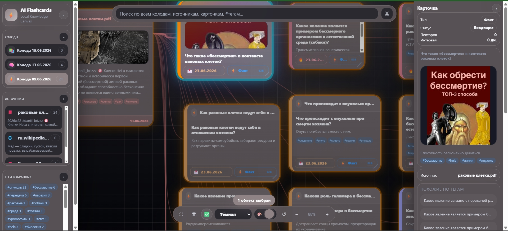

# AI Flashcard Studio




AI Flashcard Studio is a local-first flashcard generation and review application for Windows. It converts text, PDFs, images, URLs, and manual notes into structured study cards using a local AI model pipeline.

The project focuses on fast card creation, visual knowledge mapping, tag-based navigation, source-aware generation, and offline-friendly study workflows.

## 📂 Supported Formats

### Input Sources (Ingestion)
- **Documents:** PDF, DOCX, TXT, EPUB, FB2
- **Data & Decks:** CSV, TSV, Anki (`.apkg`)
- **Media:** PNG images (OCR/Vision processing)
- **Web & Video:** Standard URLs, Wikipedia articles, and YouTube videos (automatic transcript/subtitle extraction)

### Export Targets
- **Anki:** Native `.apkg` deck packages
- **Quizlet:** Optimized TSV files
- **Universal:** Standard CSV, JSON Graph structure (for visual network analysis)
- **Print-friendly:** PDF Cheat Sheets (structured question/answer sheets)

## Features

- Local AI-assisted flashcard generation
- Source-based card creation from text, PDF, image, URL, and imported files
- Canvas view with draggable cards, sources, links, tags, statuses, and card types
- Tag focus mode for highlighting related cards and source connections
- Card type support:
  - Question / answer
  - Definition
  - Fact
  - Concept
  - Cloze
  - True / false
  - Multiple choice
- Automatic mixed card type classification
- Manual card editing and image attachments
- Review statuses:
  - Inbox
  - Today
  - Planned
  - Done
- Due dates and review scheduling
- Source inspector and source-linked cards
- Similar-by-tag navigation
- Global search across decks, sources, and cards
- Keyboard and touchpad canvas navigation
- Export-oriented card data model

## Current local model direction

The app is designed around local inference. The current generation pipeline is structured so that the UI, parser, database, graph, and export logic are separate from the inference backend.

Current local model direction:
- LiteRTLM / `.litertlm` runtime for local on-device inference experiments
- Future adapter path for `llama.cpp` / GGUF models
- Local-first design without requiring a cloud inference API

Large model files are not included in the repository.

### 🛡️ Robust Generation & Repair Layer
Local LLMs can be unstable, miss JSON formatting, or hallucinate. AI Flashcard Studio implements a protective backend pipeline to ensure data integrity:
- **Strict JSON/JSONL Repairing:** Automatically fixes truncated outputs or syntax errors before parsing.
- **Thinking Token Stripping:** Cleans out internal reasoning logs (`<think>` tags) from the KV-cache to save context window and speed up inference.
- **Card Count & Type Control:** Validates card structures, normalizes tags, and triggers automated retries (fallback generation) if the model underperforms.
- **Mnemonic Handling:** Automatically injects memory hooks into cards to improve retention rates during SRS review.

## Architecture

```text
frontend:  HTML / CSS / JavaScript
backend:   Python / FastAPI
storage:   SQLite / SQLAlchemy
runtime:   local model backend
canvas:    custom HTML/CSS/JS graph UI
platform:  Windows-first local app

```

Main layers:

```text
UI → FastAPI backend → generation pipeline → parser/post-processing → SQLite → canvas graph/review/export

```

The generation pipeline handles:

* chunking
* prompt building
* model calls
* JSON/JSONL parsing
* card count control
* card type repair
* tag normalization
* mnemonic handling
* source linking
* scheduling metadata

## Canvas controls

```text
Left click card/source     select object
Click tag                  focus tag
Click status               focus status
Click card type            focus card type
Space                      clear selection/focus/search
Double Space               auto-layout canvas
Escape                     full reset + fit view
Alt/Shift + drag canvas    pan canvas
Middle mouse drag          pan canvas
Arrow keys / WASD          pan canvas
Shift + Arrow/WASD         faster pan
+ / =                      zoom in
-                          zoom out
0                          fit view

```

## 🛠️ Installation & Quick Start

The application is optimized for Windows and designed to run completely offline.

### Quick Start (Recommended)

1. Clone or download this repository.
2. Open the project root folder.
3. Double-click **`run.bat`**.

*The script will automatically set up the Python virtual environment, install all required dependencies from `requirements.txt`, start the FastAPI backend, and launch the application.*

### Manual Installation

If you prefer to set up the environment manually:

```bat
# Navigate to the project directory
python -m venv .venv
.venv\Scripts\activate
pip install -r requirements.txt
python main.py

```

Once running, open your browser and navigate to:

```text
[http://127.0.0.1:8000](http://127.0.0.1:8000)

```

## Repository hygiene

Do not commit local models, caches, databases, virtual environments, logs, or generated exports.

Recommended ignored files:

```text
.venv/
venv/
__pycache__/
*.pyc
models/
*.gguf
*.litertlm
*.safetensors
*.db
*.sqlite
*.sqlite3
logs/
exports/
user_data/
tmp/
cache/
.env
.env.local
node_modules/
dist/
build/
.DS_Store
Thumbs.db

```

## 🗺️ Roadmap

* [ ] Complete UI and technical documentation localization (English as default)
* [ ] Implement a unified **Inference Adapter Layer** to hot-swap backends
* [ ] Add native **`llama.cpp` / GGUF** support for raw local quantized models
* [ ] Add OpenAI-compatible API endpoint support (for self-hosted or cloud services)
* [ ] Optimize Canvas UI rendering performance for massive card bases (1000+ nodes)
* [ ] Improve PDF layout parsing and image-to-card extraction quality
* [ ] Expand the automated `card_output_parser` test suite

## License

License is not finalized in this repository unless a `LICENSE` file is present.

[Apache 2.0](LICENSE)
